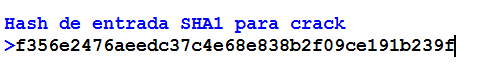
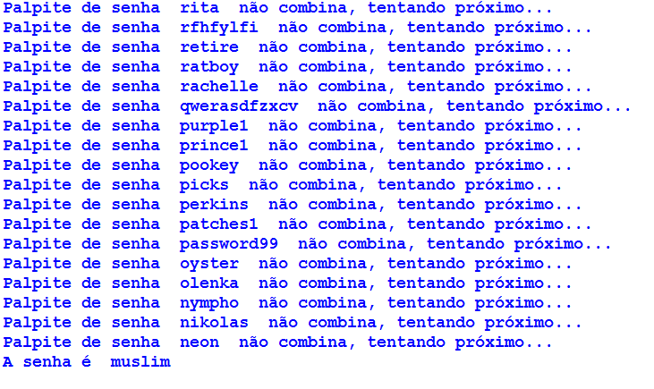

## SHA1cracker

este é o cracker senha SHA1 você pode copiar hash e passado na entrada e, em seguida, aperte enter para quebrar o hash sha1 se você quiser fazer o seu próprio banco de dados de senha basta alterar o URL e colocar o seu.

